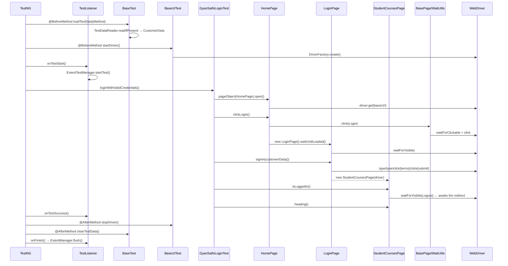

# Execution flow: `GyanSathiLoginTest.loginWithValidCredentials`

A trace of every class and method invoked, from `mvn test` to the Extent report,
for the single test method:

```java
@Test(groups = FrameworkConstants.GROUP_SMOKE,
        description = "A student signs in from the home page and lands on their courses")
public void loginWithValidCredentials() {
    StudentCoursesPage courses = pageObject(HomePage.class)
            .open()
            .clickLogin()
            .signIn(customerData());

    Assert.assertTrue(courses.isLoggedIn(), ...);
    Assert.assertTrue(courses.getCurrentUrl().contains(customerData().requireExtra("expectedLandingPath")), ...);
    Assert.assertEquals(courses.heading(), customerData().requireExtra("expectedHeading"));
}
```

---

## Phase 0 — Bootstrap

| Step | What runs | Notes |
|------|-----------|-------|
| 1 | `mvn test` | `maven-surefire-plugin` reads `<suiteXmlFiles>` from `pom.xml` |
| 2 | Surefire → TestNG, given `testng.xml` | `parallel="methods"`, `thread-count="3"` |
| 3 | TestNG registers `TestListener` | Declared as `<listener>` in `testng.xml` |
| 4 | TestNG instantiates `GyanSathiLoginTest` | Field initialisers on `BaseTest` run here |

Instantiating the test class triggers the configuration singleton, because
`BaseTest` initialises it as a field:

```
new GyanSathiLoginTest()
└─ BaseTest field init
   ├─ LogManager.getLogger(...)                       → log4j2.xml
   └─ ConfigurationManager.getInstance()              ← first call builds the singleton
      ├─ loadFrameworkProperties()                    → config/framework.properties
      ├─ get("environment", "prod")                   → resolution order: -D > env var > properties
      └─ loadApplicationConfig("gyansathi")           → applications/gyansathi/application.yml
         └─ Jackson (YAMLFactory) → ApplicationConfig
```

Then `@BeforeSuite BaseTest.logSuiteContext()` runs once and logs the application
and environment.

---

## Phase 1 — Per-method setup

TestNG runs `@BeforeMethod` **superclass first, then subclass**. So `BaseTest`
loads the data before `BaseUITest` starts the browser.

### 1a. `BaseTest.loadTestData(Method method)`

TestNG natively injects the `java.lang.reflect.Method` that is about to run.
That is how the data file gets named after the test — the test itself never asks
for its data.

```
BaseTest.loadTestData(method)                          method.getName() = "loginWithValidCredentials"
├─ CURRENT_TEST_NAME.set("loginWithValidCredentials")  ThreadLocal<String>
└─ TestDataReader.readIfPresent(GyanSathiLoginTest.class, "loginWithValidCredentials", CustomerData.class)
   ├─ TestDataReader.moduleOf(GyanSathiLoginTest.class)
   │  └─ reads @TestModule("login")                    → falls back to package's last segment if absent
   ├─ candidates(...)                                  → ["loginWithValidCredentials", "GyanSathiLoginTest"]
   ├─ exists("TestData/login/loginWithValidCredentials.json")   ← first candidate hits
   └─ JsonUtils.fromClasspath(resource, CustomerData.class)
      └─ Jackson ObjectMapper → CustomerData
         ├─ id / firstName / lastName / username / password / email / phone → mapped fields
         └─ expectedLandingPath, expectedHeading       → @JsonAnySetter addExtra() → additional map
   └─ CUSTOMER_DATA.set(customer)                      ThreadLocal<CustomerData>
```

> **Why `ThreadLocal` and not a plain field?** With `parallel="methods"`, TestNG
> shares **one instance** of `GyanSathiLoginTest` across its concurrently running
> methods. `loginWithValidCredentials` and `invalidLoginIsRejected` start in the
> same second on that one instance, so an instance field would be overwritten by
> whichever method loaded last.

### 1b. `BaseUITest.startDriver()`

```
BaseUITest.startDriver()
└─ DriverManager.initDriver()                          ThreadLocal<WebDriver>
   └─ DriverFactory.create()
      ├─ ConfigurationManager.getInstance()
      ├─ config.getBrowser()                           → BrowserType.CHROME
      ├─ buildOptions(CHROME, config)
      │  └─ ChromeDriverHelper.buildOptions(config)
      │     ├─ "--headless=new"                        if headless=true
      │     ├─ "--incognito"                           if browser.incognito=true
      │     ├─ "--no-sandbox", "--disable-dev-shm-usage", "--disable-gpu", "--remote-allow-origins=*"
      │     └─ "--window-size=1920,1080"               from window.size
      ├─ createLocalDriver(...)                        → new ChromeDriver(options)
      │                                                   Selenium Manager provisions chromedriver
      ├─ new EventFiringDecorator<>(new WebDriverEventListenerImpl()).decorate(rawDriver)
      │                                                   every later driver call is logged
      ├─ applyTimeouts(driver, config)                 implicit=0s, pageLoad=45s
      └─ applyWindow(driver, config)                   1920x1080
```

Everything downstream sees the **decorated** driver, so `beforeGet`,
`beforeClick`, `beforeSendKeys`, `beforeFindElement` and `onError` on
`WebDriverEventListenerImpl` fire for each interaction.

### 1c. `TestListener.onTestStart(ITestResult)`

Fires after the `@BeforeMethod` chain, immediately before the test body.

```
TestListener.onTestStart(result)
└─ ExtentTestManager.startTest("GyanSathiLoginTest.loginWithValidCredentials", description)
   ├─ ExtentManager.getInstance()                      builds ExtentSparkReporter on first call
   └─ CURRENT.set(extentTest)                          ThreadLocal<ExtentTest>
```

---

## Phase 2 — The test body

### Step 1 — `pageObject(HomePage.class)`

```
BaseUITest.pageObject(HomePage.class)
└─ PageFactory.custom(HomePage.class, driver())
   ├─ DriverManager.getDriver()                        the decorated, thread-local driver
   ├─ HomePage.class.getDeclaredConstructor(WebDriver.class)
   ├─ constructor.setAccessible(true)
   └─ new HomePage(driver) → BasePage(driver)
```

### Step 2 — `.open()`

```
HomePage.open()
└─ BasePage.navigate("/")
   ├─ ConfigurationManager.getInstance().getBaseUrl()  → "https://www.gyansathi.com"
   ├─ BasePage.joinUrl(base, "/")                      → base unchanged for "/"
   └─ driver.get(url)
      └─ WebDriverEventListenerImpl.beforeGet(driver, url)
```

### Step 3 — `.clickLogin()`

```
HomePage.clickLogin()
├─ BasePage.click(By.xpath("//button[normalize-space()='Login']"))
│  ├─ WaitUtils.waitForClickable(driver, locator)
│  │  └─ WebDriverWait(20s, poll 250ms).until(ExpectedConditions.elementToBeClickable)
│  ├─ SeleniumUtils.scrollIntoView(driver, element)    JS: scrollIntoView({block:'center'})
│  └─ element.click()                                  → beforeClick event
└─ new LoginPage(driver).waitUntilLoaded()
   └─ BasePage.waitForVisible(By.id("username"))
      └─ WaitUtils.waitForVisible → visibilityOfElementLocated
```

The `waitUntilLoaded()` matters: `/auth/login` is a client-rendered Next.js
route, so the URL changes before the form exists.

### Step 4 — `.signIn(customerData())`

`customerData()` is a **read**, not a load — the data was bound in Phase 1a.

```
BaseTest.customerData()
└─ CUSTOMER_DATA.get()                                 throws FrameworkException naming the
                                                        expected path if the test has no data file

LoginPage.signIn(customer)
├─ LoginPage.submitCredentials(customer)
│  ├─ BasePage.type(By.id("username"), customer.getUsername())
│  │  ├─ WaitUtils.waitForVisible(...)
│  │  ├─ element.clear()
│  │  └─ element.sendKeys(...)                         → beforeSendKeys event
│  ├─ BasePage.type(By.id("password"), customer.getPassword())
│  ├─ BasePage.click(By.id("agreedToTerms"))           MUST precede the submit click
│  └─ BasePage.click(By.cssSelector("button[type='submit']"))
│     └─ WaitUtils.waitForClickable(...)               elementToBeClickable requires ENABLED,
│                                                       so this implicitly waits out the
│                                                       `disabled` attribute on Sign In
└─ return new StudentCoursesPage(driver)               no navigation wait happens here
```

The Sign In button ships with `disabled` until username, password **and** the
terms checkbox are all set. Ticking `#agreedToTerms` before clicking submit is
therefore load-bearing, not cosmetic.

### Step 5 — Assertions

`signIn` returns immediately after the click, so nothing has yet waited for the
redirect to `/student/courses/available_courses`. **The first assertion supplies
that wait:**

```
courses.isLoggedIn()
└─ BasePage.isDisplayed(By.xpath("//button[normalize-space()='Logout']"))
   └─ WaitUtils.waitForVisible(...)                    up to 20s — this is the redirect wait
      └─ returns false instead of throwing, on timeout (isDisplayed swallows RuntimeException)

courses.getCurrentUrl()                                → driver.getCurrentUrl()
customerData().requireExtra("expectedLandingPath")     → "/student/" from the JSON's additional map

courses.heading()
└─ BasePage.getText(By.xpath("//h1[normalize-space()='Available Courses']"))
   └─ WaitUtils.waitForVisible(...).getText()
```

---

## Phase 3 — Teardown

TestNG runs `@AfterMethod` **subclass first, then superclass** — the mirror of
setup.

```
TestListener.onTestSuccess(result)
├─ ConfigurationManager.screenshotOnPass()             false by default
├─ ExtentTestManager.pass("Passed")                    (no screenshot taken on pass)
└─ log "PASS GyanSathiLoginTest.loginWithValidCredentials"

BaseUITest.stopDriver()
└─ DriverManager.quitDriver()                          driver.quit() + DRIVER.remove()

BaseTest.clearTestData()
├─ CURRENT_TEST_NAME.remove()
└─ CUSTOMER_DATA.remove()

TestListener.onFinish(context)                         once per <test>
├─ ExtentManager.flush()                               writes test-output/reports/
└─ ExtentTestManager.remove()
```

Had the test **failed**, `TestListener.onTestFailure` would instead run
`ScreenshotUtils.captureBase64()` (embedded in the report) and
`ScreenshotUtils.capture(methodName)` (a PNG under `test-output/screenshots/`).

---

## Sequence diagram



---

## Files touched, in order

| # | File | Role |
|---|------|------|
| 1 | `testng.xml` | Suite, listener, parallel mode |
| 2 | `config/framework.properties` | Browser, timeouts, report paths |
| 3 | `applications/gyansathi/application.yml` | Base URL for the environment |
| 4 | `TestData/login/loginWithValidCredentials.json` | The customer + expected values |
| 5 | `BaseTest.java` | Data loading, config, ThreadLocals |
| 6 | `TestDataReader.java` / `TestModule.java` | Resolves module + file name |
| 7 | `CustomerData.java` | Jackson binding target |
| 8 | `BaseUITest.java` | Driver lifecycle, `pageObject(...)` |
| 9 | `DriverManager` / `DriverFactory` / `ChromeDriverHelper` | Browser creation |
| 10 | `PageFactory.java` | Reflective page construction |
| 11 | `HomePage` → `LoginPage` → `StudentCoursesPage` | The page objects |
| 12 | `BasePage.java` / `WaitUtils.java` / `SeleniumUtils.java` | Action + wait layer |
| 13 | `TestListener` / `ExtentTestManager` / `ExtentManager` | Reporting |

## Caveat: the framework's own logging is off by default

Every log line shown in this trace (`Opening …`, `Clicked …`, `Typed …`) comes
from log4j2, but `log4j2.xml` lives at `src/main/resources/config/log4j2.xml` —
**not** the classpath root where log4j2 auto-discovers it — and nothing sets
`-Dlog4j2.configurationFile`. So out of the box these lines go nowhere. The
ordering in this document was captured by forcing the config on:

```
mvn test -DargLine="-Dlog4j2.configurationFile=config/log4j2.xml"
```

The test still passes without it; you just see no framework logs and no
`test-output/logs/automation.log`.

## What is *not* invoked

Worth knowing, because these classes exist and look relevant:

- **`RetryAnalyzer`** — never runs. It is not registered in `testng.xml` and no
  `@Test` sets `retryAnalyzer = RetryAnalyzer.class`. A failure is a failure.
- **`DynamicPage`, `FlowExecutor`, `Flow`, `Step`, `ActionType`** — the YAML flow
  engine. Used by `FlowDrivenTest`, not by this test.
- **`ScreenshotUtils`** — only on failure (`screenshot.on.pass=false`).
- **`RestAPIExecutor`, `DatabaseConnection`, `AxeBuilderHelper`** — unused here.

## Timeouts in play

| Setting | Value | Where it applies |
|---------|-------|------------------|
| `timeout.explicit` | 20s | Every `WaitUtils` call: clickable, visible, text |
| `timeout.polling.millis` | 250ms | `WebDriverWait` polling interval |
| `timeout.implicit` | 0s | Deliberately zero; explicit waits only |
| `timeout.pageload` | 45s | `driver.get(...)` |

## Thread-local state

Four independent `ThreadLocal`s keep `parallel="methods"` safe:

| Holder | Contents |
|--------|----------|
| `DriverManager.DRIVER` | One `WebDriver` per thread |
| `BaseTest.CURRENT_TEST_NAME` | Name of the running test method |
| `BaseTest.CUSTOMER_DATA` | That method's `CustomerData` |
| `ExtentTestManager.CURRENT` | That method's report node |
